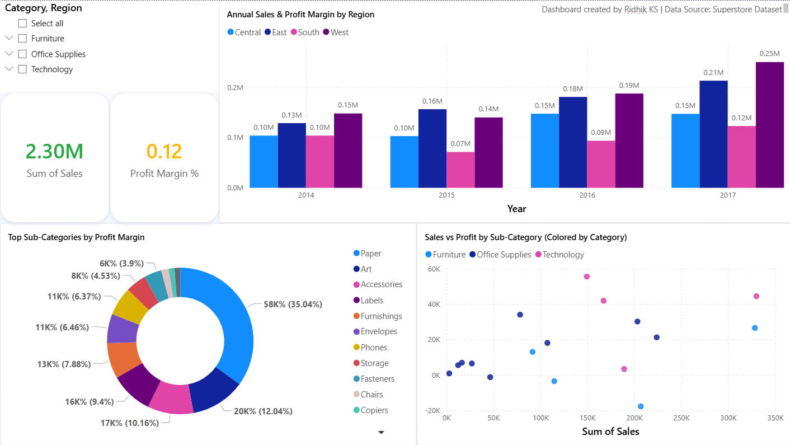

# 📊 Sales & Profit Performance Dashboard – Superstore Dataset

This Power BI dashboard presents key business insights from the popular Superstore dataset, focusing on sales trends, profit distribution, and profit margins across categories, sub-categories, and regions.

---

## 🔧 Tools & Technologies
- **Power BI**
- **DAX Measures**
- **Conditional Formatting**
- **Custom Tooltips**
- **Interactive Visualizations**

---

## 📈 Key Features
- 📌 KPI Cards for Total Sales, Total Profit, and Profit Margin %
- 🧩 Donut Chart for Category-wise Sales
- 📍 Scatter Plot for Sales vs Profit by Sub-Category
- ✅ Conditional Formatting to highlight trends (e.g., Green for Sales ↑, Red for Profit ↓)
- 🖼️ Clean layout with consistent formatting, shadows, and footer text

---

## 🧠 Business Insights
- **Top-performing categories and sub-categories** clearly visualized
- **Profit margin discrepancies** easily spotted using tooltips and color-coded KPIs
- Visual trends over time and by segment support decision-making

---

## 📂 Project Files
- `Superstore_Dashboard.pbix` – Main Power BI file
- `dashboard_preview.png` – Screenshot of the final dashboard

---

## 🤝 Credits
- **Created by**: Ridhik KS  
- **Assisted by**: [ChatGPT by OpenAI](https://chat.openai.com) for guidance on DAX, visual layout improvements, and design best practices

---

## 📸 Dashboard Preview

---

## 📝 Data Source
- Sample Superstore dataset (available publicly)

---
